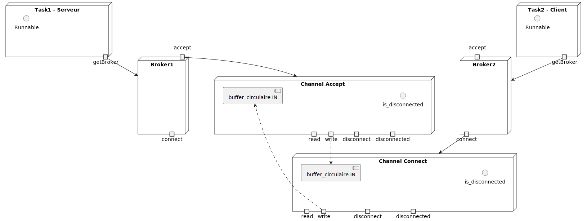
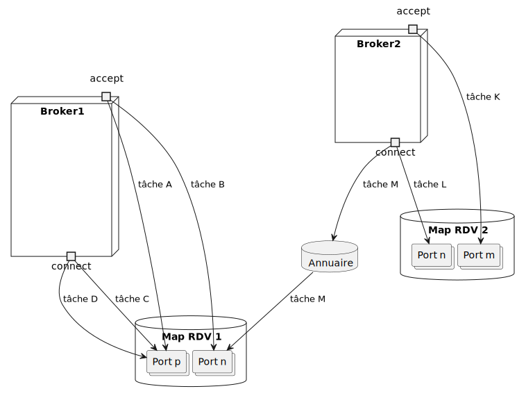
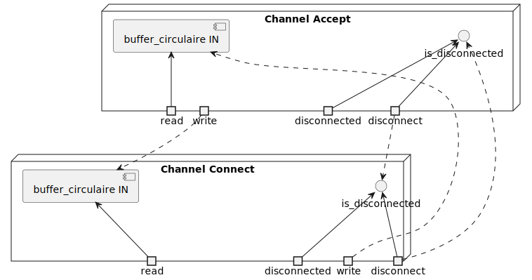

# Design du Système Broker/Channel

## 1. Vue d'ensemble

Le système implémente un modèle de communication basé sur des **brokers** et des **channels** permettant à des **tasks** (threads) de communiquer via des flux de bytes bidirectionnels, fiables (lossless) et ordonnés (FIFO).

### Concepts clés :
- **Broker** : Intermédiaire nommé qui permet l'établissement de channels
- **Channel** : Canal de communication point-à-point, full-duplex, FIFO et sans perte
- **Task** : Thread associé à un broker pour exécuter du code applicatif
- **Rendez-vous** : Mécanisme de synchronisation symétrique entre `accept()` et `connect()`

## 2. Architecture des composants

### 2.1 Hiérarchie des classes

- **Broker** (abstrait) → **CBroker** (implémentation concrète)
- **Channel** (abstrait) → **CChannel** (implémentation concrète)  
- **Task** (concret, étend Thread)
- **CircularBuffer** (utilitaire)

### 2.2 Relations entre composants

- Un broker peut être partagé par plusieurs tasks
- Un broker peut gérer plusieurs channels
- Un channel connecte exactement deux endpoints
- Une task peut utiliser plusieurs channels

## 3. Composants principaux

### 3.1 Broker

**Responsabilités :**
- Maintenir un registre global des brokers par nom (unicité garantie)
- Gérer les opérations d'accept/connect sur différents ports
- Orchestrer le rendez-vous symétrique entre accept et connect
- Assurer la thread-safety pour les accès concurrents

**Mécanisme accept/connect :**
1. **Accept(port)** : Vérifie qu'aucun autre accept n'est en cours sur ce port, vérifie si un connect correspondant est déjà en attente, sinon bloque jusqu'à ce qu'un connect correspondant arrive
2. **Connect(brokerName, port)** : Cherche le broker distant dans le registre global, retourne null si introuvable, sinon établit/rejoint le rendez-vous

### 3.2 Channel

**Responsabilités :**
- Fournir un flux de bytes bidirectionnel, FIFO et sans perte
- Gérer la déconnexion asynchrone depuis les deux côtés
- Implémenter la sémantique de lecture/écriture bloquante

**Structure interne :**
- Un objet `CChannel` de chaque côté de la connexion (Acceptant et Connectant)
- Un buffer circulaire pour chaque direction de communication (un buffer pour A→C et un autre pour C→A)
- Mécanismes de synchronisation pour les opérations bloquantes

**Comportement des opérations :**
- **Lecture** : Bloque si aucune donnée disponible, retourne le nombre d'octets lus
- **Écriture** : Bloque si buffer plein, retourne le nombre d'octets écrits
- **Déconnexion** : Asynchrone, préserve les données en transit, débloque les opérations en attente

### 3.3 Task

**Responsabilités :**
- Thread d'exécution associé à un broker
- Établir des connexions via son broker (accept/connect)
- Exécuter du code applicatif fourni comme `Runnable`

**Caractéristiques :**
- Étend `Thread`, démarrée avec `start(Runnable)`
- Associée à un broker (plusieurs tasks peuvent partager le même broker)
- Aucune propriété exclusive sur les channels

**Contraintes de concurrence :**
- Une seule task peut faire `accept()` sur un port donné
- Plusieurs tasks peuvent partager un channel avec synchronisation appropriée

## 4. Gestion de la déconnexion

### 4.1 Protocole de déconnexion
- **Côté local** : `disconnect()` marque le channel comme déconnecté localement
- **Côté distant** : La déconnexion est perçue progressivement
- **Données en transit** : Préservées jusqu'à lecture complète
- **Opérations bloquées** : Débloquées avec retour approprié

### 4.2 États de déconnexion
- **Connecté** : Les deux côtés peuvent lire/écrire
- **Semi-déconnecté** : Un côté a déconnecté, l'autre peut encore lire les données en transit
- **Déconnecté** : Plus aucune opération possible, channel inutilisable

